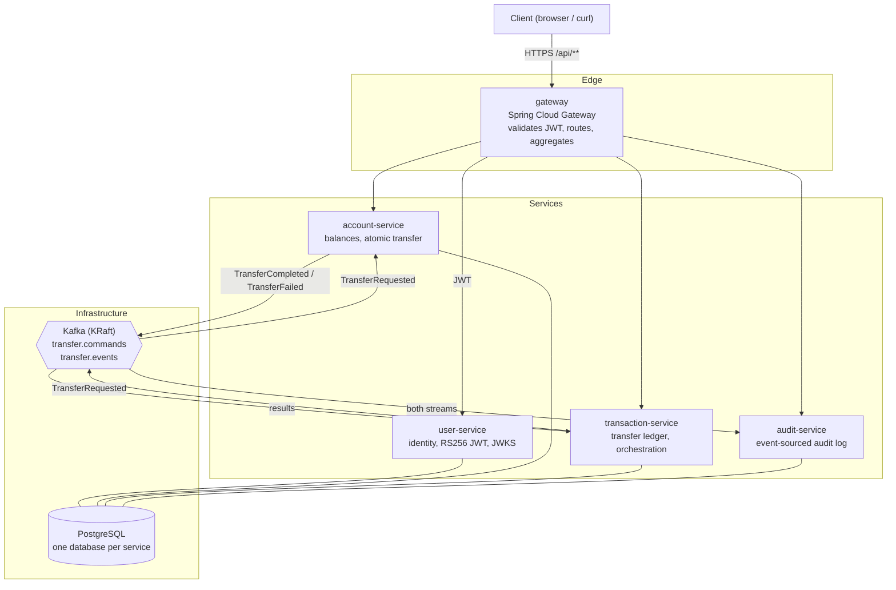
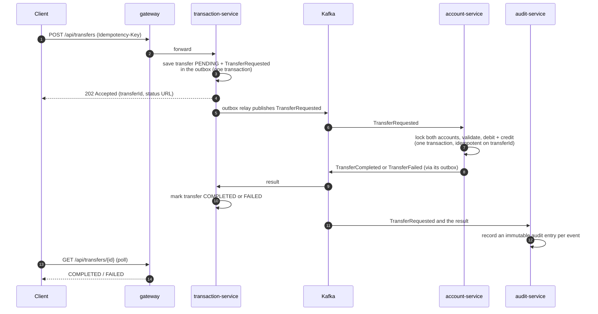
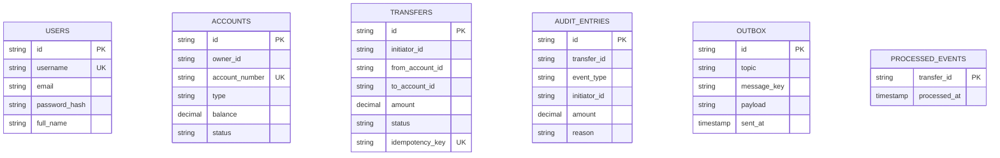

# Architecture

This is a small bank built as event-driven microservices. The interesting part
is not the feature list, it is that the money path is correct: a transfer cannot
double-spend, cannot leave a balance negative, and survives a service or broker
restart without losing or inventing money. Everything else exists to support
that claim and to make it easy to see how the pieces fit.

## What is event-driven and what is not

Being precise about this matters, because most demos blur it.

- **Synchronous (request/response over HTTP):** everything a client does. The
  gateway authenticates the request and routes it to a service: register, log
  in, open an account, deposit, read balances, start a transfer, read a
  transfer's status.
- **Asynchronous (events over Kafka):** the transfer itself. Starting a transfer
  returns immediately with `202 Accepted`; the actual money movement happens on
  the event path and the client polls for the result. The audit trail is built
  by a separate consumer of the same event streams.

So the system is synchronous at the edge and event-driven in its core, where the
hard consistency problem lives.

## Containers

Only the gateway is reachable from outside. Every service validates the same
RS256 JWT against user-service's JWKS, so a request that slips past the gateway
still cannot read or move another user's money. Each service owns its own
database; no service reads another's tables.

## The transfer saga

A transfer is coordinated by transaction-service and executed by account-service.
Both accounts live in account-service's database, so the debit and credit are a
single local ACID transaction. We still route the transfer through Kafka rather
than a direct call, because that is what gives us a durable, replayable, audited
record and what would let the destination move to another service or bank later.

Three properties make this correct rather than just plausible:

- **Idempotency.** account-service records each transferId it has applied, so a
  redelivered request (Kafka is at-least-once) never moves money twice. The same
  guard protects transaction-service when it consumes results.
- **No lost or phantom events.** Each service writes its state change and the
  event it wants to publish in the same database transaction (the transactional
  outbox); a relay forwards outbox rows to Kafka afterwards. The event cannot be
  published without the state change committing, and cannot be dropped after it.
- **No double-spend.** account-service takes a pessimistic write lock on both
  accounts (in a fixed id order to avoid deadlocks) before touching balances, so
  concurrent transfers on the same account serialize. A `CHECK (balance >= 0)`
  constraint is the backstop. A test fires twenty simultaneous transfers against
  one account and asserts exactly the affordable ones succeed.

Poison messages (anything that keeps failing) are routed to per-topic
dead-letter topics rather than blocking the partition or being silently dropped.

## Data model

Each service owns its schema. The outbox and processed-events tables appear only
in the services that publish or consume events.

`OUTBOX` lives in account-service and transaction-service; `PROCESSED_EVENTS`
lives in account-service (keyed by the transfer it applied) and transaction-service
(keyed by the result it consumed). `AUDIT_ENTRIES` is unique on
(transfer_id, event_type) so a redelivered event is recorded once.

## Security model

- user-service issues an RS256 JWT on login and publishes its public keys at
  `/.well-known/jwks.json`.
- The gateway and every service validate that JWT; the user id always comes from
  the token's `sub` claim, never from a request parameter or body.
- Ownership is enforced on every account and transfer resource, so one user
  cannot read or move another user's money.
- Passwords are hashed with BCrypt. Secrets come from the environment, never the
  source tree.

## Observability

Each service bridges Micrometer observations to OpenTelemetry and exports spans
over OTLP. Kafka producer and consumer observation is turned on, so the W3C
`traceparent` header rides along on every record and the trace continues on the
far side of the broker: a single trace shows transaction-service publishing a
command and account-service plus audit-service consuming it. An opt-in compose
override (`docker-compose.observability.yml`) adds Tempo for traces, Prometheus
for metrics, and Grafana to view both; tracing is off in the lean default run and
on under the override.

One honest limitation worth calling out: the HTTP request that starts a transfer
and the Kafka publish that carries it out are linked but separate traces, not one
tree. That is a direct consequence of the outbox pattern, the relay publishes on
its own schedule, decoupled from the request thread, so the producer span roots
at the relay rather than the original request. Joining them would mean storing
the trace context in the outbox row and restoring it in the relay. It is a
deliberate tradeoff (durability over a single tidy trace), not an accident.
